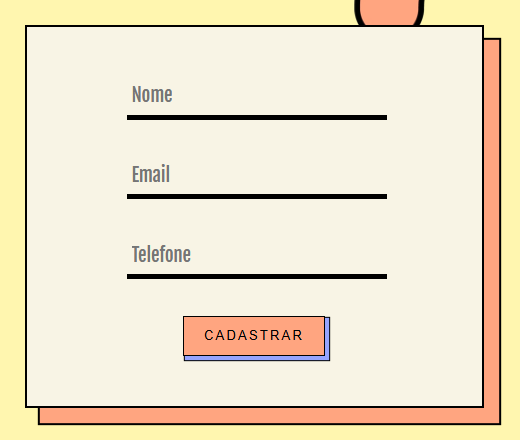
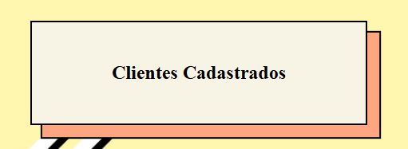
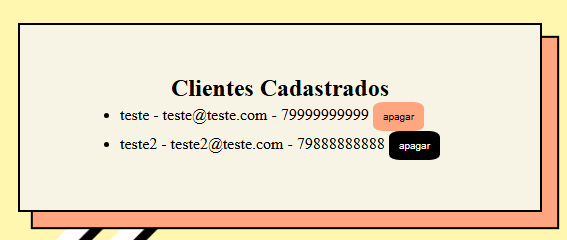

# 🧾 Sistema de Cadastro de Clientes (Flask + SQLite)


Sistema web simples e funcional para **cadastro, visualização e exclusão de clientes**. Desenvolvido como desafio prático de aprimoramento nas tecnologias **Python (Flask), HTML, CSS e SQLite**.

---

## 🎯 Funcionalidades

- ✅ Cadastro de clientes (nome, e-mail, telefone)
- ✅ Listagem automática dos clientes
- ✅ Exclusão com um clique
- ✅ Layout moderno e responsivo
- ✅ Código limpo e comentado

---

## 🖼️ Interface

### 🧾 Cadastro de Cliente

!

---

### 📋 Lista de Clientes

!
---

### 🗑️ Exclusão de Cliente (GIF)

!

---

## 🧠 Tecnologias

- [x] Python 3  
- [x] Flask  
- [x] SQLite  
- [x] HTML5  
- [x] CSS3  
- [x] Jinja2 (Template Engine)

---

## ⚙️ Estrutura do Projeto
```
cliente-cadastro/
├── app.py  #Backend Flask
├── clientes.db  #Banco de dados SQLite
├── static/
│ └── style.css  #Estilização
├── templates/
│ └── index.html  #Página principal
└── venv/ # Ambiente virtual
```

---

## ▶️ Como rodar localmente

```bash
# 1. Clone o repositório
git clone https://github.com/AllissonCosta/Cadastro-de-Clientes.git
cd Cadastro-de-Clientes

# 2. Crie e ative o ambiente virtual
python -m venv venv
No PowerShell: venv\Scripts\activate
No MacOs ou linux: source venv/bin/activate

# 3. Se estiver dando erro de permissão no PowerShell, execute isso antes:
Set-ExecutionPolicy RemoteSigned -Scope Process


# 3. Instale o Flask
pip install flask

# 4. Execute o servidor
python app.py

# Acesse em:
http://localhost:5000


📌 Observações
O banco de dados SQLite é criado automaticamente ao rodar o projeto.
